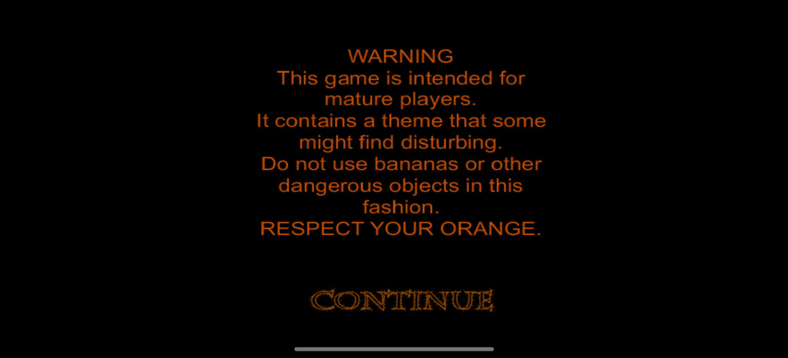
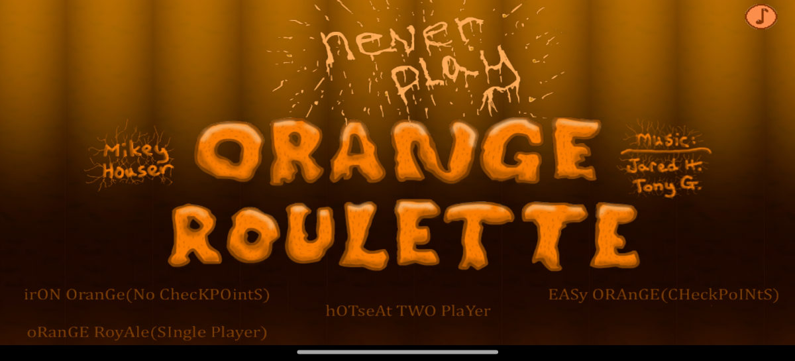
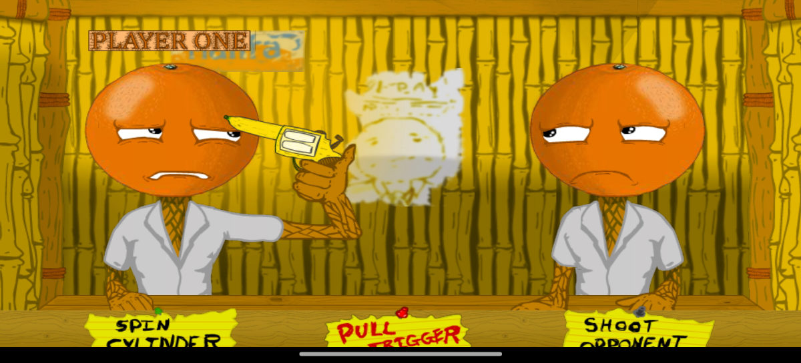

# ZettaBridge

**Run 32-bit Android apps on 64-bit-only ARM phones.**
A source-available ARM32 -> ARM64 native code translator and app launcher.

> **Independent fork:** This repository is maintained by a different person from the
> original project owner. It has no affiliation with, endorsement from, or operational
> relationship to the original project or its owner. The inherited OnePlus 13 screenshots
> and results below are the original owner's historical evidence; this fork has not
> reproduced them.

---

A growing number of recent phone SoCs (for example the Snapdragon 8 Elite) have no AArch32
execution state at all. Old apps that ship only `armeabi` / `armeabi-v7a` native libraries
cannot start on them, and there is no hardware fallback.

The inherited launcher runs such an app as a plugin inside a process owned by ZettaBridge:
- the app's Java/Kotlin code runs natively on the phone's normal 64-bit ART;
- only the app's 32-bit native code is translated to AArch64.

The inherited plugin launcher needs no root, custom ROM, or system image changes.

The current source is the inherited non-root plugin launcher described below. This
fork's selected product is an offline per-app converter and narrow root manager; that
installed-package path is not implemented yet. Root is planned only for explicitly
authorized manager operations, never to run the guest. See [plan.md](plan.md).

> **Status: early development.** Not usable by end users yet. See [Roadmap](#roadmap).

## Orange Roulette, a 2014 armeabi game, on a phone with no 32-bit CPU

| Intro | Menu | Gameplay |
|---|---|---|
|  |  |  |

Every pixel above was drawn by translated 32-bit ARM code on the original project owner's OnePlus 13
(Snapdragon 8 Elite). This is inherited upstream evidence, not a device result from this fork.

## How the inherited launcher works

This diagram describes the current plugin runtime. It does not describe the per-app
conversion architecture selected by this fork's plan.

```
ZettaBridge launcher (arm64 app)
 |
 +-- imports an APK as a plugin, pins a home-screen shortcut (nothing is installed)
 +-- :guest process
      +-- plugin Java code on the real 64-bit ART
      +-- libzbridge.so (arm64)
           +-- Dynarmic: A32/T32 -> AArch64 JIT, 4 GiB guest address space
           +-- syscall layer: 32-bit Linux ABI -> 64-bit kernel
           +-- guest threads, signals, "carrier" threads for Java callers
           +-- JNI bridge: a synthesized 32-bit JNIEnv / JavaVM
      +-- real arm32 Android system libraries (linker, libc, libm, libc++, ...)
```

- **Native code is translated by [Dynarmic](https://github.com/Vita3K/dynarmic)**
  (0BSD), an ARM dynamic recompiler, with a small local patch for ARMv8 Thumb-2 opcodes.
- **The guest runs the real arm32 bionic.** The Android linker, libc and friends come from
  an AOSP system image. ZettaBridge translates Linux syscalls, not libc functions.
- **Java <-> native goes through a JNI bridge.**
  - `System.loadLibrary` on a 32-bit library loads a tiny arm64 proxy instead.
  - The proxy binds the guest's `Java_*` exports and runs its `JNI_OnLoad`.
  - Guest native code talks to Java through a synthesized 32-bit `JNIEnv`.
- **Old native libraries are fixed up at import.** Text relocations and absolute
  `DT_NEEDED` paths are rewritten, because modern Android linkers refuse them.

## What works today

- **Translator core.** On aarch64 Linux via `zbrun`, and on a real phone both in Termux and
  inside an app process next to ART:
  - static and dynamic arm32 Android executables through the real arm32 linker;
  - threads, signals, C++ exceptions, `dlopen`, kernel user helpers.
- **Launcher.** Imports APKs as plugins with home-screen shortcuts. 64-bit apps already run
  as plugins, including apps with Firebase/AdMob, Jetpack Compose and Flutter.
- **JNI bridge.** Implemented and tested against a mock JVM on the host:
  - guest `JNIEnv`/`JavaVM`;
  - Java -> guest native calls from multiple Java threads;
  - `RegisterNatives`;
  - library loading and `Java_*` binding.
- **GLES 2.0 and 3.0 passthrough, EGL and ANativeWindow.** Guests create their own GL context
  on their own thread; ~490 entry points are generated from the Khronos registry.
- **Games running on the phone.**
  - *Orange Roulette* (2014, Haxe/OpenFL): menus and gameplay, with sound.
  - *Flappy Bird* (AndEngine): playable.
  - A modern Flutter app starts, runs its Dart code, presents frames and takes touch input,
    though rendering is not yet complete.

`NativeActivity` (including Unity and pure-NDK entry points) and Vulkan are not supported
yet. The current source also does not produce normally installed packages with their own
PackageManager identity; that is the goal of this fork, not a working feature.

## Roadmap

The inherited milestone table described the original plugin launcher and is retired.
This fork's active scope, step dependencies, acceptance criteria, and evidence live in
[plan.md](plan.md). The next work is to establish a reproducible baseline before adding
the APK analyzer or root manager.

## Honest limits

- **Speed.** Translated code runs slower than native. The inherited estimates of roughly
  2x for integer code and 3.5x for memory copies were measured on the original project
  owner's Snapdragon 8 Elite, not on this fork's Pixel 11 target.
- **3D games are harder, not off-limits.** Every call from the app into the system, and
  OpenGL ES calls in particular, crosses a translation boundary, so 3D-heavy games will be
  slow at first. Making them playable is a goal. Planned work:
  - batching GL calls;
  - faster floating point;
  - host-side JNI fast paths.
- **Repacking changes the signer.** Apps that require the original signing identity,
  signature permissions, certificate-bound APIs, or server trust may fail. Root does
  not bypass these checks.
- **Integrity and anti-emulation checks may reject translated code.** The project does
  not bypass Play Integrity, DRM, or app security controls.

## Building (development)

See [docs/development.md](docs/development.md) for the pinned toolchain, clean
checkout, repeatable Dynarmic patch setup, sysroot extraction, and build commands.

`tools/extract_sysroot.sh` downloads the pinned Android 17 QPR 2 AOSP GSI and extracts
the arm32 system libraries into the ignored `sysroot/`. See [plan.md](plan.md) for the
fork's current scope and [docs/development.md](docs/development.md) for the reproducible
build and verification workflow.

## Supporting the project

ZettaBridge is written by one person. If it runs an app you needed, [Boosty](https://boosty.to/zailox)
keeps the work going.

## Contributing

The project is young. The most useful contributions right now are issues that name
old 32-bit apps you want to run. Include the app name and version, where the APK comes
from, and what happens.

## License

ZettaBridge is **source-available, not open source**. Two licences apply cumulatively (see
[LICENSE](LICENSE)): **PolyForm Noncommercial 1.0.0** and **PolyForm Perimeter 1.0.1**. Read it,
change it, share it for noncommercial purposes. What both together forbid: making money from it,
and providing others a competing product - a competing product counts even when it is free.

Commercial use of any kind - selling it, shipping it inside a product, preinstalling it in a
device ROM - needs a separate licence from the author, which is available on request.

Contributions are accepted with a copyright assignment; see [CONTRIBUTING.md](CONTRIBUTING.md).

Third-party code keeps its own licence; see `third_party/README.md`. Dynarmic is 0BSD and the
Khronos registry files are Apache-2.0. AOSP system libraries used at run time are Apache-2.0 and
are not part of this repository.
